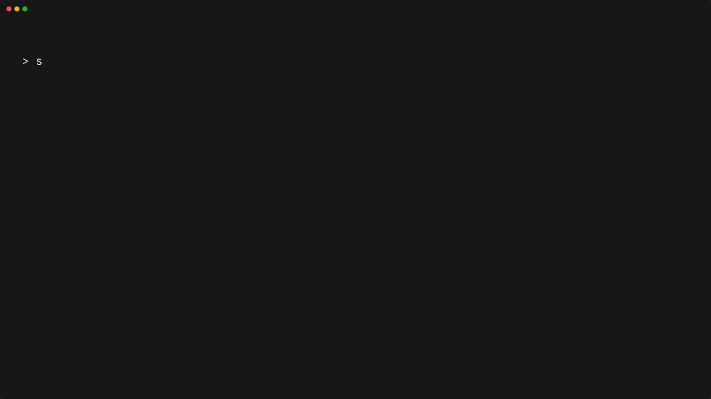

<h2 align="center">skypaw: Weather CLI/TUI Tool</h2>

<div align="center">

[](https://github.com/zenpaw-labs/skypaw/releases)
[](https://github.com/microsoft/winget-pkgs/tree/master/manifests/z/Zenpaw/Skypaw)
[](https://aur.archlinux.org/packages/skypaw-bin)

[](https://github.com/zenpaw-labs/skypaw/releases)
[](https://github.com/zenpaw-labs/skypaw/actions/workflows/go.yml)
[](go.mod)
[](LICENSE)

</div>


Lightweight weather CLI Tool written in Go.
- 📍 Auto-detects your location (or set a static city)
- 📊 Temperature diagram for surrounding hours
- 💾 Offline weather cache
- 🎨 Colorful TUI with configurable output



## ⚡ Quick start
```
# Windows
winget install skypaw

# Arch Linux
yay -S skypaw-bin

# Run skypaw
skypaw
```

## 🚀 Installation

### All platforms
If you have Go installed, you can just compile it from sources. Run in directory:
```
go build -ldflags="-X 'github.com/zenpaw-labs/skypaw/cmd.semVersion=dev' -s -w" ./cmd/skypaw
```

### Windows (WinGet)
Open the cmd and run:
```
winget install skypaw
```
### Arch Linux (AUR)
Run in shell:
```
yay -S skypaw-bin
```

## ⚙️ Configuration
See [CONFIG.md](CONFIG.md) for all available options.

## 🛠 Development
### Build from sources
Just for your platform use [this](#all-platforms). To build release binaries locally:
```
goreleaser release --snapshot --clean
```

## 📄 License
This project is licensed under the [MIT License](LICENSE).

## ☕ Support
#### If you find this project useful, you can support us with a coin!
[](https://send.monobank.ua/23MWDFXsRa)
